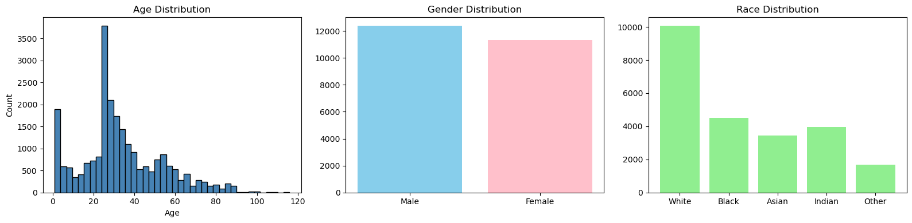
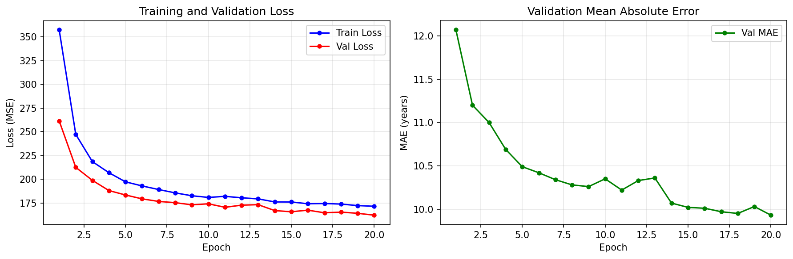
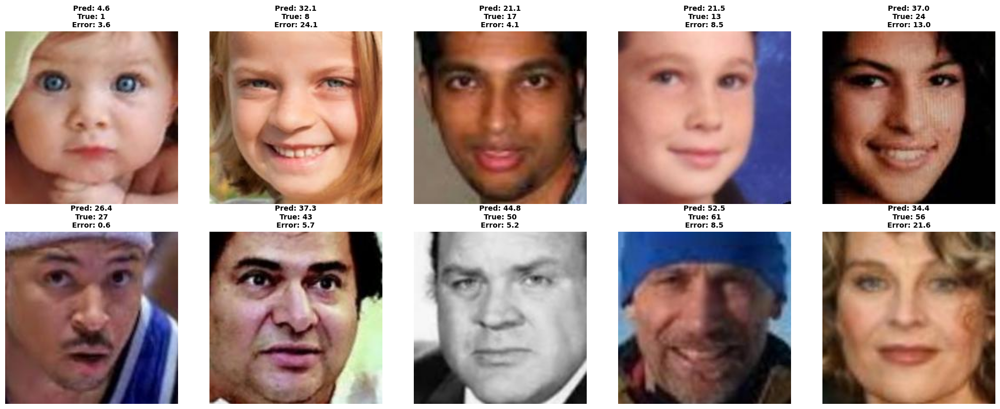

# گزارش تمرین: تخمین سن از روی تصویر با استفاده از یادگیری انتقالی

**نام:** علی طبیب آذر

---

## 1. توضیح مسئله

در این تمرین هدف، تخمین سن افراد از روی تصویر صورت بود. برای این کار از روش یادگیری انتقالی (Transfer Learning) استفاده کردم و طبق پیشنهاد صورت تمرین، دیتاست UTKFace را انتخاب کردم. پیاده‌سازی کامل با فریم‌ورک PyTorch انجام شده و شبکه پایه هم ResNet50 است که یکی از چهار شبکه مجاز تمرین (AlexNet، VGGNet، ResNet و MobileNet) محسوب می‌شود.

چون سن یک مقدار پیوسته است، مسئله را به صورت رگرسیون مدل کردم نه طبقه‌بندی؛ یعنی خروجی شبکه یک عدد است و تابع هزینه هم MSE انتخاب شد.

## 2. بررسی اولیه داده‌ها (EDA)

اطلاعات هر تصویر از اسم فایل آن استخراج می‌شود. فرمت اسم فایل‌ها به صورت `سن_جنسیت_نژاد_تاریخ.jpg` است؛ مثلاً فایلی که با `100_1_0` شروع شود مربوط به فرد 100 ساله، زن و سفیدپوست است.

دیتاست در مجموع 23705 تصویر معتبر دارد. خلاصه آماری سن به این صورت است:

| مقدار | عدد |
|---|---|
| میانگین | 33.3 |
| میانه | 29 |
| انحراف معیار | 19.9 |
| کمینه / بیشینه | 1 / 116 |

*شکل 1: توزیع سن، جنسیت و نژاد در دیتاست*

چند نکته که از این نمودارها می‌شود گرفت:

- توزیع سن به شدت نامتوازن است. دو قله بزرگ وجود دارد: یکی بچه‌های زیر 4 سال (1894 تصویر) و دیگری جوان‌های 20 تا 30 سال. در مقابل، سالمندان بالای 60 سال نمونه‌های خیلی کمی دارند.
- توزیع جنسیت تقریباً متوازن است (12391 مرد و 1114 زن).
- از نظر نژاد، گروه سفیدپوست با 10078 تصویر غالب است؛ این مورد را به عنوان یکی از محدودیت‌های کار در نظر می‌گیرم.

به خاطر همان قله بچه‌ها، طبق پیشنهاد صورت تمرین، تعداد تصاویر افراد زیر 4 سال را به حداکثر 50 نمونه محدود کردم تا داده‌ها بالانس‌تر شوند. بعد از این کار تعداد تصاویر به 22311 رسید.

## 3. پیش‌پردازش

- تغییر اندازه همه تصاویر به 224x224
- نرمال‌سازی با میانگین و انحراف معیار ImageNet، چون مدل پیش‌آموزش‌دیده با همین مقادیر آموزش دیده است
- اضافه کردن RandomHorizontalFlip به عنوان augmentation برای مجموعه آموزش
- تقسیم داده‌ها به 80% آموزش و 20% اعتبارسنجی

## 4. مدل و یادگیری انتقالی

مدل ResNet50 با وزن‌های آموزش‌دیده روی ImageNet لود شد. سپس لایه‌های استخراج ویژگی فریز شدند و فقط لایه آخر با یک لایه خطی تک‌خروجی جایگزین شد:

دلیل انتخاب ResNet50 این بود که نسبت به VGG سبک‌تر و سریع‌تر است و نسبت به AlexNet ویژگی‌های خیلی بهتری یاد می‌گیرد؛ در عین حال پیچیدگی MobileNet را هم برای این تمرین لازم نداشتم.

تنظیمات آموزش:

| پارامتر | مقدار |
|---|---|
| Epoch | 20 |
| Batch size | 32 |
| Optimizer | Adam با نرخ یادگیری 0.001 |
| تابع هزینه | MSELoss |
| سخت‌افزار | GPU (CUDA) |

## 5. روند آموزش

*شکل 2: منحنی loss و MAE در طول آموزش*

| Epoch | Train Loss | Val Loss | Val MAE |
|---|---|---|---|
| 1 | 357.37 | 261.52 | 12.07 |
| 5 | 197.34 | 183.50 | 10.49 |
| 10 | 180.94 | 174.21 | 10.35 |
| 15 | 176.14 | 165.85 | 10.02 |
| 20 | 171.62 | 162.23 | 9.93 |

نکته قابل توجه این است که val loss از train loss کمتر است. دلیلش این است که موقع آموزش، augmentation و Dropout فعال هستند و کار مدل سخت‌تر است، ولی موقع اعتبارسنجی خاموش‌اند. نکته مهم‌تر این است که شکاف بین دو منحنی زیاد نشده و یعنی overfitting اتفاق نیفتاده است.

## 6. نتایج

*شکل 3: پیش‌بینی سن روی نمونه‌هایی از گروه‌های سنی مختلف*

معیار اصلی ارزیابی MAE است که روی مجموعه اعتبارسنجی به **9.93 سال** رسید؛ یعنی به طور متوسط خطای مدل حدود 10 سال است.

از شکل 3 چند مشاهده می‌شود:

- روی بزرگسالان و میانسالان مدل خوب عمل می‌کند؛ مثلاً فرد 27 ساله را 26.4 پیش‌بینی کرده که خطای آن فقط 0.6 سال است.
- روی کودکان خطای زیادی دارد؛ بچه 8 ساله را 32 ساله زده است. دلیلش این است که مدل تمایل دارد سن را به سمت میانگین دیتاست (حدود 33 سال) بکشد و کم بودن نمونه‌های این گروه هم مزید بر علت است.
- خانم 56 ساله را 34 ساله زده است؛ البته در تصویر هم جوان‌تر از سن واقعی به نظر می‌رسد، یعنی مدل بیشتر «سن ظاهری» چهره را یاد گرفته است.

## 7. جمع‌بندی و پیشنهادات

در این تمرین یک مدل تخمین سن با یادگیری انتقالی روی دیتاست UTKFace پیاده‌سازی شد. عدم توازن داده‌ها با محدود کردن تعداد تصاویر کودکان کنترل شد، مدل بدون overfitting همگرا شد و در نهایت به MAE حدود 9.93 سال رسید.

برای بهبود کار چند پیشنهاد وجود دارد:

1. **Fine-tuning کامل:** اگر بعد از چند epoch لایه‌های فریزشده با نرخ یادگیری خیلی کم (مثل 1e-5) باز شوند، مدل می‌تواند ویژگی‌های ظریف‌تر چهره کودکان و سالمندان را یاد بگیرد.
2. **استفاده از learning rate scheduler** برای همگرایی بهتر در epochهای پایانی.
3. **Augmentation بیشتر** مانند چرخش و تغییر روشنایی و کنتراست.
4. بالانس‌تر کردن کل بازه‌های سنی در صورت امکان، نه فقط گروه کودکان.