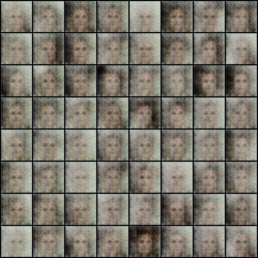
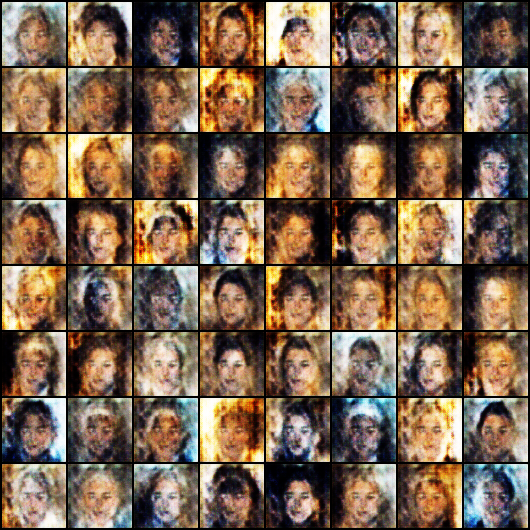
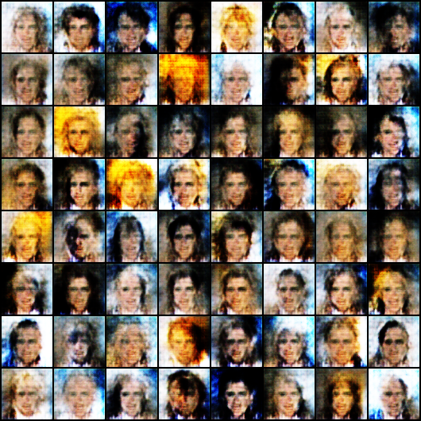
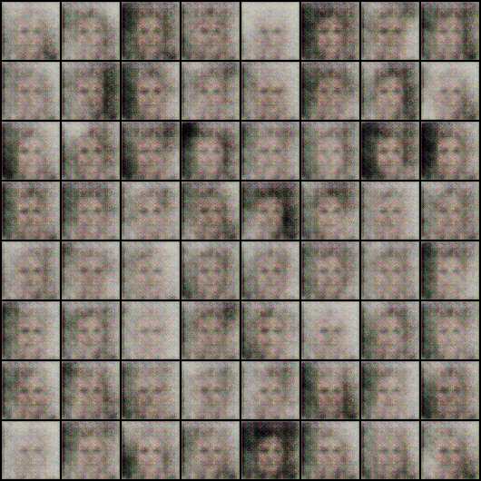

# گزارش تمرین Deep Learning - پیاده‌سازی DCGAN برای تولید تصویر چهره

## 1. مقدمه

در این تمرین، یک شبکه مولد تخاصمی (GAN) با معماری DCGAN پیاده‌سازی کردم که می‌تونه تصاویر چهره انسان تولید کنه. هدف اصلی این بود که با فرآیند آموزش GANها و چالش‌های اون آشنا بشم.

## 2. دیتاست

از دیتاست **CelebA** استفاده کردم که شامل تصاویر چهره افراد مشهوره. به دلیل محدودیت زمان و منابع محاسباتی، از 15,000 تصویر اول این دیتاست استفاده کردم. تصاویر به سایز 64x64 پیکسل resize شدن و نرمال‌سازی روی بازه [-1, 1] انجام شد.

## 3. معماری مدل

### Generator
Generator از یک لایه ورودی با 100 نویز تصادفی شروع می‌شه و با استفاده از لایه‌های ConvTranspose2d، تصویر رو به تدریج بزرگ‌تر می‌کنه تا به سایز 64x64 برسه. از BatchNorm و ReLU برای پایداری بیشتر آموزش استفاده کردم.

### Discriminator
Discriminator برعکس Generator عمل می‌کنه و با لایه‌های Conv2d، تصویر رو به یک عدد بین 0 و 1 تبدیل می‌کنه که نشون می‌ده تصویر ورودی واقعی هست یا جعلی. از LeakyReLU با alpha=0.2 استفاده شد.

## 4. پارامترهای آموزش

| پارامتر | مقدار |
|---------|-------|
| Image Size | 64x64 |
| Batch Size | 128 |
| Learning Rate | 0.0002 |
| Beta1 | 0.5 |
| Epochs | 10 |
| Optimizer | Adam |

## 5. روند آموزش و نتایج

### 5.1 روند تکامل مدل

در ادامه، تصاویر تولید شده در epochهای مختلف رو می‌بینید که نشون می‌ده مدل چطور از نویز تصادفی به سمت تولید چهره‌های واقعی حرکت کرده:

**[تصویر 1: نتایج epoch اول]**

*شکل 1: نتایج epoch اول - مدل هنوز در حال یادگیری ساختار اولیه چهره‌هاست*

**[تصویر 2: نتایج میانی آموزش]**

*شکل 2: نتایج میانی آموزش - رنگ‌ها و ساختار چهره واضح‌تر شدن*

**[تصویر 3: نتایج epoch 10]**

*شکل 3: نتایج epoch 10 - بهترین کیفیت با چهره‌های واضح و طبیعی*

### 5.2 انیمیشن روند آموزش

برای درک بهتر روند آموزش، یک GIF از تمام epochها تهیه کردم:

**[GIF روند آموزش]**

*شکل 4: انیمیشن روند تکامل مدل از epoch 0 تا 10*

### 5.3 تحلیل Loss

در طول آموزش، مشاهده کردم که:
- در epochهای اول، Discriminator خیلی سریع یاد می‌گیره و Loss_G بالا هست
- به تدریج Generator بهتر می‌شه و تعادل نسبی بین دو شبکه برقرار می‌شه
- نوساناتی در کیفیت تصاویر دیده می‌شه که طبیعیه و به ذات ناپایدار GANها برمی‌گرده

## 6. چالش‌ها و محدودیت‌ها

1. **محدودیت دیتاست:** به دلیل زمان محدود، از 15,000 تصویر به جای کل دیتاست (200,000+ تصویر) استفاده کردم که روی تنوع تصاویر نهایی تأثیر داشت.

2. **تعداد epoch کم:** با 10 epoch، مدل هنوز به همگرایی کامل نرسیده بود. با epochs بیشتر (20-30)، کیفیت بهتری قابل دستیابی بود.

3. **نوسانات آموزش:** همان‌طور که در GIF مشخصه، کیفیت تصاویر در epochهای مختلف نوسان داره که از چالش‌های ذاتی DCGANهاست.

## 7. نتیجه‌گیری

در این تمرین تونستم یک DCGAN پیاده‌سازی کنم که قادر به تولید تصاویر چهره انسان هست. با وجود محدودیت‌های زمانی و محاسباتی، مدل تونسته ساختار کلی چهره (چشم، بینی، دهان) و تنوع رنگی (رنگ‌های مختلف مو و پوست) رو یاد بگیره.

نتایج نشون می‌ده که:
- معماری DCGAN برای تولید تصاویر چهره مناسبه
- آموزش GANها نیاز به صبر و تنظیم دقیق hyperparameterها داره
- با دیتاست بزرگتر و epochs بیشتر، می‌تون به نتایج بسیار بهتری رسید

