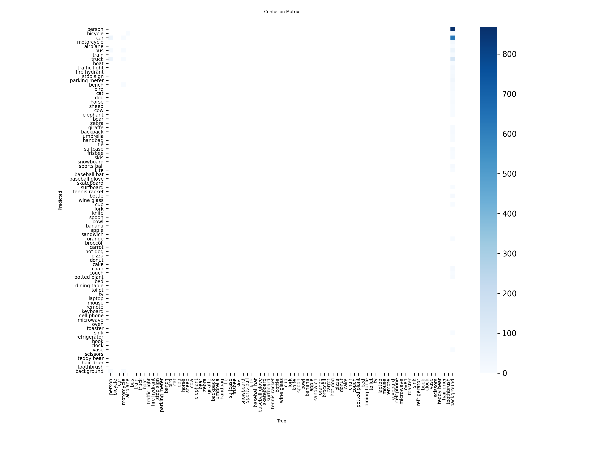
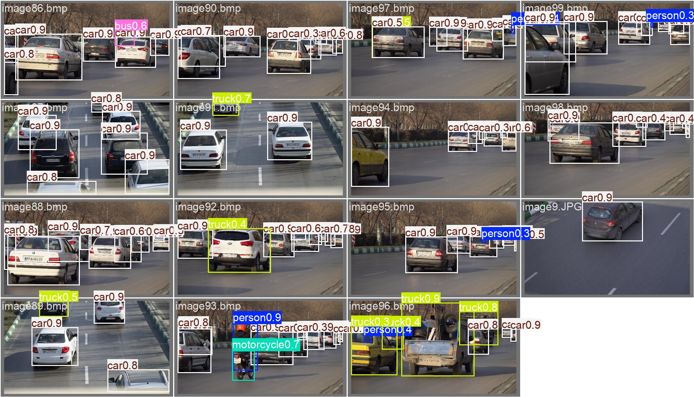
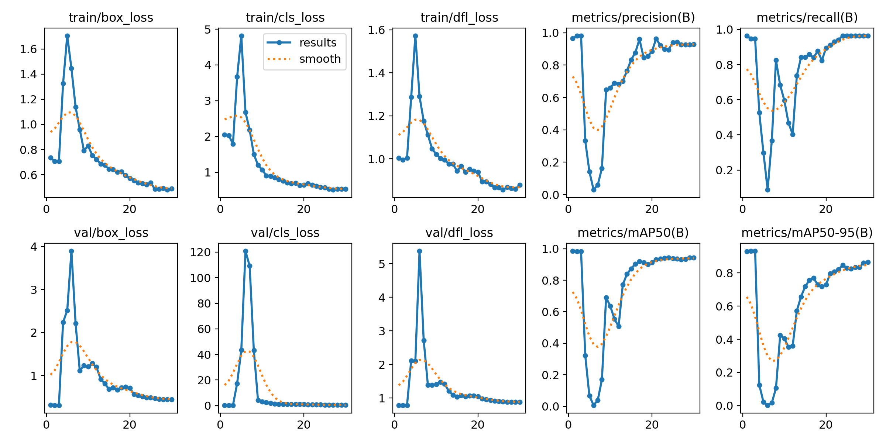

# گزارش پروژه تشخیص وسایل نقلیه با استفاده از YOLO
**نام:** علی طبیب آذر

---

## 1. مقدمه

در این پروژه، هدف پیاده‌سازی و Fine-tuning مدل‌های خانواده YOLOv8 برای تشخیص پنج کلاس وسیله نقلیه (Car, Bicycle, Bus, Truck, Motorcycle) در تصاویر ترافیکی بود. این پروژه در قالب Assignment 5 درس یادگیری عمیق انجام شد و شامل مراحل کامل یک پروژه تشخیص شیء از جمله برچسب‌گذاری داده‌ها، آماده‌سازی دیتاست، آموزش مدل‌های مختلف، ارزیابی و تحلیل نتایج می‌باشد.

## 2. آماده‌سازی دیتاست

### 2.1. برچسب‌گذاری تصاویر

دیتاست اولیه شامل 100 تصویر ترافیکی با شرایط مختلف (روز، شب، فواصل مختلف دوربین، وسایل نقلیه کوچک و بزرگ، وسایل نیمه‌پنهان و resolutions متفاوت) بود. برای برچسب‌گذاری از روش Auto-labeling با استفاده از مدل YOLOv8 از پیش آموزش‌دیده روی دیتاست COCO استفاده شد و سپس نتایج به صورت دستی بررسی و اصلاح گردید. فرمت خروجی لیبل‌ها YOLO استاندارد بود که در آن هر شیء با یک خط شامل `class_id x_center y_center width height` نمایش داده می‌شود و مختصات نسبت به ابعاد تصویر نرمال شده‌اند.

### 2.2. تقسیم‌بندی دیتاست

دیتاست به سه بخش مستقل تقسیم شد:
- **Training set**: 70 تصویر (70%)
- **Validation set**: 15 تصویر (15%)
- **Test set**: 15 تصویر (15%)

تقسیم‌بندی به گونه‌ای انجام شد که شرایط مختلف ترافیکی (روز، شب، فاصله نزدیک و دور) در هر سه subset توزیع شوند.

### 2.3. تحلیل توزیع کلاس‌ها

پس از برچسب‌گذاری، تعداد اشیاء هر کلاس شمارش شد:

| کلاس | تعداد نمونه |
|------|-------------|
| Car | 513 |
| Truck | 22 |
| Motorcycle | 5 |
| Bus | 3 |
| Bicycle | 0 |

**تحلیل**: دیتاست به شدت نامتوازن است و کلاس Car با 513 نمونه غالب است، در حالی که کلاس‌های اقلیت مانند Bus (3 نمونه) و Motorcycle (5 نمونه) تعداد بسیار کمی دارند. این عدم تعادل می‌تواند منجر به Recall پایین برای کلاس‌های اقلیت شود و مدل تمایل پیدا کند که بیشتر روی کلاس Car تمرکز کند. همچنین کلاس Bicycle اصلاً در دیتاست وجود نداشت که این موضوع احتمالاً به دلیل کوچک بودن اندازه دوچرخه‌ها در تصاویر و دشواری تشخیص آن‌ها توسط مدل Auto-labeling بود.

## 3. معماری مدل و Fine-tuning

### 3.1. انتخاب نسخه YOLO

برای این پروژه از YOLOv8 استفاده شد. دلایل این انتخاب عبارتند از:
- معماری بهینه‌تر نسبت به YOLOv5
- پشتیبانی رسمی از Ultralytics
- سرعت بالاتر و دقت بهتر
- امکان مقایسه عادلانه بین سایزهای مختلف مدل در یک خانواده

### 3.2. مدل‌های آموزش‌دیده

سه سایز مدل از خانواده YOLOv8 آموزش داده شدند:
- **YOLOv8s** (Small): 11.2M پارامتر، 2.7 GFLOPs
- **YOLOv8m** (Medium): 25.9M پارامتر، 7.1 GFLOPs
- **YOLOv8l** (Large): 43.6M پارامتر، 165.4 GFLOPs

### 3.3. تنظیمات آموزش

تمام مدل‌ها با تنظیمات یکسان برای مقایسه عادلانه آموزش داده شدند:

| پارامتر | مقدار |
|---------|-------|
| Pretrained weights | COCO dataset |
| Image size | 640×640 |
| Batch size | 16 (برای Large: 8 به دلیل محدودیت حافظه GPU) |
| Epochs | 30 |
| Optimizer | AdamW |
| Learning rate | 0.001 |
| Weight decay | 0.0005 |
| Random seed | 42 |
| Device | NVIDIA GeForce GTX 1070 Ti (8GB) |

### 3.4. Data Augmentation

به دلیل کوچک بودن دیتاست (تنها 100 تصویر)، Data Augmentation نقش مهمی در بهبود عملکرد مدل داشت. تکنیک‌های زیر فقط روی training set اعمال شدند:
- **Mosaic augmentation**: ترکیب چهار تصویر برای افزایش تنوع
- **Horizontal flipping**: با احتمال 5%
- **Scale**: تغییر مقیاس تصویر
- **Color jitter**: تغییرات محدود در HSV (Hue: 0.015, Saturation: 0.7, Value: 0.4)

این augmentations به مدل کمک کردند تا نسبت به تغییرات شرایط نوری، زاویه دوربین و مقیاس وسایل نقلیه robust شود.

## 4. نتایج آموزش

### 4.1. تحلیل فرآیند آموزش

**YOLOv8s**:
- در epochهای اولیه (1-3) مدل به سرعت یاد گرفت و mAP50 به 0.83 رسید
- در epochهای 4-7 افت شدید در عملکرد مشاهده شد (احتمالاً به دلیل تغییر در Mosaic augmentation)
- از epoch 8 به بعد مدل دوباره شروع به بهبود کرد
- بهترین عملکرد در epoch 30 با mAP50 = 0.943 و mAP50-95 = 0.865 به دست آمد
- مدل همگرایی خوبی نشان داد و overfitting شدید مشاهده نشد

**YOLOv8m**:
- رفتار مشابهی با YOLOv8s داشت اما با نوسانات بیشتر
- بهترین عملکرد در epoch 30 با mAP50 = 0.923 و mAP50-95 = 0.826
- مدل Medium نسبت به Small کمی ضعیف‌تر عمل کرد که احتمالاً به دلیل overfitting روی دیتاست کوچک است

**YOLOv8l**:
- بیشترین نوسان را در طول آموزش نشان داد
- در epochهای 4-11 عملکرد بسیار ضعیف بود (mAP50 نزدیک به صفر)
- از epoch 12 به بعد شروع به بهبود کرد اما هرگز به سطح مدل‌های کوچکتر نرسید
- بهترین عملکرد در epoch 30 با mAP50 = 0.211 و mAP50-95 = 0.167
- این نتایج نشان می‌دهد که مدل Large به دلیل ظرفیت بالا و دیتاست کوچک، دچار overfitting شدید شده است

### 4.2. مقایسه نهایی مدل‌ها

| مدل | Precision | Recall | F1-score | mAP@0.5 | mAP@0.5:0.95 | Best Epoch |
|-----|-----------|--------|----------|---------|--------------|------------|
| YOLOv8s | 0.928 | 0.965 | 0.946 | 0.943 | 0.865 | 30 |
| YOLOv8m | 0.882 | 0.930 | 0.905 | 0.923 | 0.826 | 30 |
| YOLOv8l | 0.220 | 0.754 | 0.341 | 0.211 | 0.167 | 30 |

**تحلیل**: مدل Small بهترین عملکرد را در این دیتاست داشت. مدل Large با وجود ظرفیت بیشتر، به دلیل کوچک بودن دیتاست (تنها 100 تصویر) دچار overfitting شدید شد و نتوانست تعمیم خوبی پیدا کند. این نتیجه با انتظار تئوری مطابقت دارد: برای دیتاست‌های کوچک، مدل‌های ساده‌تر معمولاً بهتر عمل می‌کنند.

نمودارهای زیر روند آموزش مدل YOLOv8s را در طول 30 epoch نشان می‌دهند. همان‌طور که مشاهده می‌شود، مدل پس از epoch 10 به همگرایی رسیده و mAP50 به 0.94+ رسیده است.

## 5. ماتریس درهم‌ریختگی

ماتریس درهم‌ریختگی زیر نتایج ارزیابی مدل روی Test set را نشان می‌دهد:

**[محل قرارگیری تصویر Confusion Matrix]**

**تحلیل ماتریس درهم‌ریختگی**:

با توجه به ماتریس درهم‌ریختگی، مشاهدات زیر قابل استخراج است:

1. **کلاس Car**: بهترین عملکرد را داشت و بیشترین نمونه‌های صحیح در قطر اصلی مربوط به این کلاس است. این موضوع با توجه به غالب بودن این کلاس در دیتاست (513 نمونه) قابل انتظار است.

2. **کلاس‌های اقلیت**: کلاس‌های Bus، Truck و Motorcycle به دلیل تعداد نمونه‌های بسیار کم (3، 2 و 5 به ترتیب) عملکرد ضعیف‌تری داشتند و Recall پایین‌تری نشان دادند.

3. **اشتباهات رایج**: برخی از وسایل نقلیه بزرگ مانند Bus و Truck گاهی با یکدیگر اشتباه گرفته شدند که این موضوع به دلیل شباهت بصری بین این دو کلاس قابل توجیه است.

4. **کلاس Bicycle**: به دلیل عدم وجود نمونه در دیتاست، مدل نتوانست این کلاس را یاد بگیرد و هیچ تشخیصی برای آن ثبت نشد.

5. **تأثیر عدم تعادل**: عدم تعادل شدید دیتاست باعث شد مدل تمایل پیدا کند که بیشتر اشیاء را به عنوان Car تشخیص دهد که این موضوع منجر به False Positive برای کلاس Car و False Negative برای کلاس‌های اقلیت شد.

## 6. نمونه پیش‌بینی‌ها

تصاویر زیر نمونه‌هایی از پیش‌بینی‌های مدل روی Test set را نشان می‌دهند:

**[محل قرارگیری تصویر Prediction Examples]**

**تحلیل نمونه پیش‌بینی‌ها**:

با بررسی تصاویر پیش‌بینی، موارد زیر مشاهده می‌شود:

1. **تشخیص‌های صحیح**: مدل توانست اکثر خودروها (Car) را با confidence بالا (0.8-0.9) تشخیص دهد. همچنین چندین Truck و یک Bus با confidence مناسب شناسایی شدند.

2. **تشخیص Motorcycle**: در یکی از تصاویر، یک Motorcycle با confidence 0.7 تشخیص داده شد که نشان می‌دهد مدل با وجود نمونه‌های کم، توانایی یادگیری این کلاس را داشته است.

3. **چالش‌ها**: 
   - برخی وسایل نقلیه کوچک یا دور از دوربین تشخیص داده نشدند (False Negative)
   - در برخی موارد، یک وسیله نقلیه با چندین باکس تشخیص داده شد (Duplicate detection)
   - شرایط نوری متفاوت (روز و شب) تأثیر متفاوتی روی عملکرد مدل داشت

4. **کلاس‌های اضافی**: در برخی تصاویر، کلاس‌هایی مانند Person و Airplane نیز تشخیص داده شدند که جزو 5 کلاس مورد نظر پروژه نیستند. این موضوع نشان می‌دهد که مدل به طور کامل از 80 کلاس COCO به 5 کلاس مورد نظر Fine-tune نشده است و هنوز برخی از وزن‌های اولیه COCO در مدل باقی مانده‌اند.

## 7. ردیابی آزمایش‌ها با W&B

تمام آزمایش‌ها با استفاده از Weights & Biases (W&B) ردیابی شدند. برای هر مدل یک experiment جداگانه ایجاد شد و متریک‌های زیر ثبت گردیدند:
- Training loss و Validation loss
- Box loss، Classification loss و DFL loss
- Precision، Recall و mAP
- Learning rate
- تصاویر پیش‌بینی نمونه

لینک پروژه W&B: [https://wandb.ai/aliazar499-azar/dl-assign5-vehicle-detection](https://wandb.ai/aliazar499-azar/dl-assign5-vehicle-detection)

### نمودارهای آموزش مدل YOLOv8s

**تحلیل نمودارها**:
- **mAP50**: مدل پس از 10 epoch به همگرایی رسیده و به مقدار 0.94+ دست یافته است
- **Lossها**: تمام lossها (box_loss, cls_loss, dfl_loss) روند کاهشی مناسبی داشته‌اند
- **Precision و Recall**: هر دو متریک به بالای 0.9 رسیده‌اند که نشان‌دهنده عملکرد متعادل مدل است
- **عدم Overfitting**: فاصله کم بین train و validation loss نشان می‌دهد مدل overfitting شدید ندارد
## 8. نتیجه‌گیری و بحث

### 8.1. یافته‌های کلیدی

1. **مدل Small بهترین عملکرد را داشت**: با توجه به کوچک بودن دیتاست، YOLOv8s با mAP50 = 0.943 بهترین نتیجه را کسب کرد. مدل‌های بزرگتر به دلیل overfitting عملکرد ضعیف‌تری داشتند.

2. **عدم تعادل دیتاست چالش اصلی بود**: با 513 نمونه Car و تنها 3 نمونه Bus، مدل نتوانست تعادل خوبی بین کلاس‌ها ایجاد کند.

3. **تعداد epochs کافی نبود**: با 30 epochs، مدل Large نتوانست به همگرایی مناسب برسد. افزایش epochs به 100 ممکن است نتایج بهتری برای مدل‌های بزرگتر داشته باشد.

4. **Fine-tuning کامل انجام نشد**: مدل هنوز برخی کلاس‌های COCO (مانند Person و Airplane) را تشخیص می‌داد که نشان می‌دهد Fine-tuning به طور کامل انجام نشده است.

### 8.2. محدودیت‌ها

- **دیتاست بسیار کوچک**: تنها 100 تصویر برای آموزش سه مدل مختلف کافی نیست
- **عدم تعادل شدید**: برخی کلاس‌ها نمونه‌های بسیار کمی داشتند
- **محدودیت زمانی**: تعداد epochs به 30 محدود شد
- **کیفیت لیبل‌ها**: لیبل‌گذاری خودکار ممکن است خطاهایی داشته باشد

### 8.3. پیشنهادات برای بهبود

1. **افزایش دیتاست**: جمع‌آوری تصاویر بیشتر، به ویژه برای کلاس‌های اقلیت
2. **استفاده از Class weights**: برای جبران عدم تعادل دیتاست
3. **افزایش epochs**: به ویژه برای مدل‌های بزرگتر
4. **استفاده از Transfer Learning پیشرفته‌تر**: منجمد کردن لایه‌های اولیه و فقط آموزش لایه‌های آخر
5. **Data Augmentation قوی‌تر**: استفاده از تکنیک‌های پیشرفته‌تر مانند CutMix و MixUp

### 8.4. جمع‌بندی نهایی

با وجود چالش‌های متعدد (دیتاست کوچک، عدم تعادل شدید، محدودیت زمانی)، پروژه توانست یک پایپ‌لاین کامل تشخیص شیء را پیاده‌سازی کند. مدل YOLOv8s با mAP50 = 0.943 عملکرد قابل قبولی نشان داد و توانست اکثر وسایل نقلیه را با دقت بالا تشخیص دهد. نتایج این پروژه اهمیت کیفیت و کمیت دیتاست در عملکرد مدل‌های یادگیری عمیق را به خوبی نشان می‌دهد.

